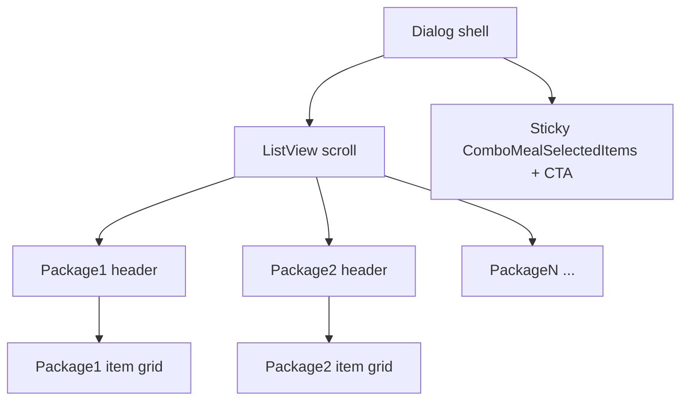

# Combo meal: dialog parity + stacked groups UI

## Part A — Same entry as unified customization

- Replace [`showComboMealBottomSheet`](lib/views/kiosk/menu_widget/components/combo_meal/combo_meal_widget.dart) with **`showComboMealDialog`** using [`showAppDialog`](lib/core/helpers/app_dialogs.dart), `barrierDismissible: false` (same as [`_handleUnifiedCustomization`](lib/views/kiosk/menu_widget/components/menu_product_tap_handler.dart)).
- Wrap [`ComboMealWidget`](lib/views/kiosk/menu_widget/components/combo_meal/combo_meal_widget.dart) in the same **`Dialog` + `SizedBox`** shell as [`KioskProductCustomizationSheet`](lib/views/kiosk/menu_widget/components/item_customization/kiosk_product_customization_sheet.dart) (~95% x 92% screen, rounded corners, inset padding). Remove bottom-sheet handle bar.
- Wire [`menu_product_tap_handler.dart`](lib/views/kiosk/menu_widget/components/menu_product_tap_handler.dart) `_handleComboMeal` to call `showComboMealDialog`.

## Part B — UI: every group, then its selections under it

**Current behavior (narrow layout):** horizontal package chips select **one** active package; [`ComboMealPackageSelector`](lib/views/kiosk/menu_widget/components/combo_meal/combo_meal_package_selector.dart) shows only `packages[_currentPackageIndex]`; bottom strip is selected summary + add to cart.

**Target behavior:** one **vertical scroll** where **each package is a section**:

1. **Section header** for that group (name, “Choose N item(s)”, remaining / complete badge) — same information as today’s [`_buildPackageHeader`](lib/views/kiosk/menu_widget/components/combo_meal/combo_meal_package_selector.dart) / [`_buildRemainingIndicator`](lib/views/kiosk/menu_widget/components/combo_meal/combo_meal_package_selector.dart).
2. **Immediately below:** that package’s **item grid** (reuse [`ComboMealItemCard`](lib/views/kiosk/menu_widget/components/combo_meal/combo_meal_item_card.dart) + `notifier.selectItem` / counts — logic unchanged).

**Layout structure:**

- **Body:** `Column` with `Expanded` → `ListView` / `CustomScrollView` → for each `state.comboMeal!.packages`, one block: header row + `GridView` with `shrinkWrap: true` and `NeverScrollableScrollPhysics` (or equivalent) so the outer scroll owns scrolling.
- **Footer (sticky):** keep [`ComboMealSelectedItems`](lib/views/kiosk/menu_widget/components/combo_meal/combo_meal_selected_items.dart) + add-to-cart CTA **below** the scroll (fixed height or `Intrinsic` min), like the mock “Selected items” + total + primary button.

**Refactors:**

- Extract from [`ComboMealPackageSelector`](lib/views/kiosk/menu_widget/components/combo_meal/combo_meal_package_selector.dart) a **non-expanded** block widget (e.g. `ComboMealPackageSection`) — header + shrink-wrapped grid — so it can live inside a scroll view. Remove the inner `Expanded` around `_buildItemsGrid` for this use case.
- In [`combo_meal_widget.dart`](lib/views/kiosk/menu_widget/components/combo_meal/combo_meal_widget.dart): replace `_buildNarrowLayout`’s horizontal tabs + single `ComboMealPackageSelector` with the stacked sections list. **Remove `_currentPackageIndex`** and the `ref.listen` auto-advance between packages (no longer needed when all groups are visible). Optionally drop `_buildPackageTabsHorizontal` / narrow-only tab UI entirely.
- **`_buildWideLayout`:** either align to the same stacked scroll for consistency on large screens, or keep side-by-side only if product still wants it; default recommendation is **one stacked scroll everywhere** inside the dialog for one code path.

## Out of scope

- Changing provider rules (`ComboMealNotifier`, selection limits) — only layout/presentation.
- Full pixel-perfect match to marketing screenshots (colors/copy) beyond structure above.

## Verification

- Dialog opens like customization; all combo groups visible in order; each group’s cards sit under that group’s title.
- Selecting items in any group updates state and footer summary; add to cart still works; close resets provider.
