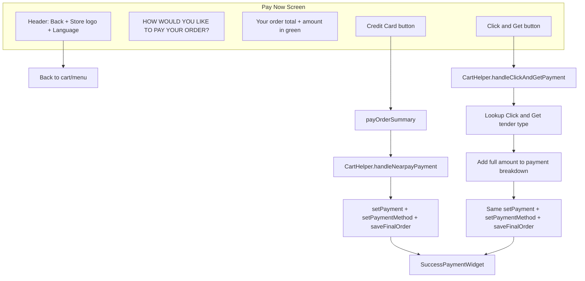

# Pay Now Widget Redesign Plan

## Current behavior

- [pay_now_widget.dart](lib/views/kiosk/pay_widget/pay_now_widget.dart): Uses `PayHeaderComponent` (credit card icon + "Pay here" title). Payment starts automatically in `initState` via `payOrderSummary()`, and the whole screen tap also triggers `payOrderSummary()`.
- Payment flow: `payOrderSummary()` → `CartHelper().handleNearpayPayment(...)` → on success `setPayment(totalAmount)` → `CartHelper().saveFinalOrder(invoice)` → navigate to `SuccessPaymentWidget`.
- Store logo elsewhere: [menu_prime_category_sidebar.dart](lib/views/kiosk/menu_widget/components/menu_prime_category_sidebar.dart) uses `selectedReportGroupIdProvider`; `reportGroupId == 5` → `AppAssets.steakLogo`, else → `AppAssets.piatoLogo`.
- [cart_helper.dart](lib/views/kiosk/cart/cart_helper.dart): `handleNearpayPayment` runs the terminal flow (or sets `nearpayPaymentDoneProvider = true` when no terminal/debug/zero). `setNearPayPaymentMethod(ref, amount)` adds one payment to breakdown using NearPay/Mada tender type from `SaleTenderTypeTable`.

## Target UI (from design)

- **Top bar**: Back arrow (left), **store-dependent logo** (center), language "العربية" + globe (right).
- **Content** (light brown/tan): Title "HOW WOULD YOU LIKE TO PAY YOUR ORDER?", "Your order total", **amount in green** with currency.
- **Two buttons** (side by side):
  - **Credit Card**: Yellow background, card-at-terminal icon, label "Credit Card" → keep current flow (`payOrderSummary` + `handleNearpayPayment`).
  - **Click & Get**: Dark green background, cash icon, label "Click & Get" → new flow (no terminal; record payment and go to success).

---

## 1. Top bar with store-dependent logo

- **New header component** (or refactor [pay_header_component.dart](lib/views/kiosk/pay_widget/components/pay_header_component.dart)) for the Pay Now screen that includes:
  - Back button (left): e.g. `IconButton` with `Icons.arrow_back` → `context.pop(context)` or `context.go(MenuWidget.routePath)` so user returns to cart/menu without paying.
  - Center: Store logo from `selectedReportGroupIdProvider` (same logic as [menu_prime_category_sidebar.dart](lib/views/kiosk/menu_widget/components/menu_prime_category_sidebar.dart)):
    - `reportGroupId == 5` → `Image.asset(AppAssets.steakLogo, ...)`
    - else → `Image.asset(AppAssets.piatoLogo, ...)`
  - Right: Language switcher (e.g. "العربية" + globe) if already used elsewhere in kiosk; reuse that pattern.
- Make the component a `ConsumerWidget` (or accept `WidgetRef`) so it can `ref.read(selectedReportGroupIdProvider)`.
- Handle `selectedReportGroupIdProvider` being `null` (e.g. show a default logo or Piato) so the pay screen still works if opened from a path where store was not selected.

---

## 2. Content layout and copy

- Replace the current single “Pay here” + credit card block with:
  - Title: "HOW WOULD YOU LIKE TO PAY YOUR ORDER?" (reuse or add to `translator` for AR/EN).
  - Subtitle: "Your order total".
  - Order total amount in **green** with currency icon (reuse existing currency asset, e.g. `AppAssets.saudiRiyalSymbolGreen` if available, or style in green).
- Keep [order_summary_component.dart](lib/views/kiosk/pay_widget/components/order_summary_component.dart) if you still want a detailed breakdown below, or simplify to only the total line in the new layout; the design suggests a compact “order total” line is enough in the main card.

---

## 3. Two payment buttons

- **Remove** auto-payment from `initState` in [pay_now_widget.dart](lib/views/kiosk/pay_widget/pay_now_widget.dart). Do **not** call `payOrderSummary()` on load or on generic screen tap.
- Add two distinct buttons:
  - **Credit Card**
    - Yellow background, icon (e.g. [AppAssets.creditCard](lib/core/assets/app_assets.dart) or card-at-terminal asset).
    - On tap: call existing `payOrderSummary()` (which uses `CartHelper().handleNearpayPayment(...)` then `setPayment` → save → success).
  - **Click & Get**
    - Dark green background, icon: [AppAssets.clickGetIcon](lib/core/assets/app_assets.dart).
    - On tap: call a **new** handler (e.g. `handleClickAndGetPayment()` or `payWithClickAndGet()`) that does **not** call the terminal.
- Remove the `GestureDetector` that triggers `payOrderSummary()` on the whole screen so only the Credit Card button starts the NearPay flow.

---

## 4. New Click & Get payment flow

- **In [cart_helper.dart](lib/views/kiosk/cart/cart_helper.dart)** add a method, e.g. `handleClickAndGetPayment` (or `setClickAndGetPaymentMethod` + a small orchestrator in the widget), that:
  1. Takes `BuildContext`, `WidgetRef`, `SalesInvoice` (or total amount + order uuid), and optionally the same `orderSummary`/total used on the screen.
  2. Does **not** call `handleNearpayPayment` or any terminal API.
  3. Resolves the **tender type** for “Click & Get”:
  - Use `SaleTenderTypeTable.getAll()` and find a tender whose `name` matches a known key (e.g. `"click and get"` or `"click & get"`), with `isDeleted == 0` and e.g. `languageId == 1` to get `tenderTypeId`. If the name in DB differs, use a normalized comparison (e.g. lowercase, trim).
  - If no such tender exists, decide fallback: either show an error (“Click & Get not configured”) or use another tender type; document that a “Click & Get” tender must exist in sync for this option to work.
  1. Updates payment breakdown: clear or ensure no duplicate, then add one payment for the full order total with that tender type (reuse the same pattern as `setNearPayPaymentMethod`: build `PaymentChoiceData` from the tender, then `ref.read(paymentBreakdownProvider.notifier).addPayment(..., totalAmount, tenderTypeId)`).
  2. Calls the **same success path** as Credit Card: set `availablePaymentMethodsProvider` if needed, then call the same `setPayment(totalAmount)` logic used after NearPay (so `CartHelper().setNearPayPaymentMethod` is replaced by a “set payment method by tender” step for Click & Get), then build `salesPayMethodsList` via existing `setPaymentMethod()` in the widget, assign to `invoice.salesOrderPayMethods`, call `CartHelper().saveFinalOrder(invoice)`, and navigate to `SuccessPaymentWidget`.
- To avoid duplication, consider a shared “complete payment and navigate to success” method that both flows use after their respective “set payment breakdown” step (e.g. in the widget: `setPayment(totalAmount)` + `setPaymentMethod()` + `saveFinalOrder` + push success).

---

## 5. File and code changes summary

| Area                                                                                         | Action                                                                                                                                                                                                                                                                                                                                                                                        |
| -------------------------------------------------------------------------------------------- | --------------------------------------------------------------------------------------------------------------------------------------------------------------------------------------------------------------------------------------------------------------------------------------------------------------------------------------------------------------------------------------------- |
| [pay_header_component.dart](lib/views/kiosk/pay_widget/components/pay_header_component.dart) | Replace with (or add) a header that has back button, **store logo from `selectedReportGroupIdProvider`** (same rule as menu sidebar), and language switcher. Requires ref/watch.                                                                                                                                                                                                              |
| [pay_now_widget.dart](lib/views/kiosk/pay_widget/pay_now_widget.dart)                        | Remove `payOrderSummary()` from `initState` and from full-screen `GestureDetector`. Add two buttons (Credit Card, Click & Get). Credit Card tap → `payOrderSummary()`. Click & Get tap → new `handleClickAndGetPayment` (or wrapper). Keep `setPayment`/`setPaymentMethod`/`saveFinalOrder`/success navigation reusable for both.                                                             |
| [cart_helper.dart](lib/views/kiosk/cart/cart_helper.dart)                                    | Add `handleClickAndGetPayment` (or `setClickAndGetPaymentMethod` + helper) that looks up “Click & Get” tender, adds full amount to payment breakdown, then lets the widget complete via existing `setPayment`/`setPaymentMethod`/`saveFinalOrder` flow.                                                                                                                                       |
| Pay widget content                                                                           | New or updated widget for the tan card: title “HOW WOULD YOU LIKE TO PAY YOUR ORDER?”, “Your order total”, green total amount, and the two buttons. Reuse or adapt [background_image_component.dart](lib/views/kiosk/pay_widget/components/background_image_component.dart) and [order_summary_component.dart](lib/views/kiosk/pay_widget/components/order_summary_component.dart) as needed. |
| Providers                                                                                    | Use existing `selectedReportGroupIdProvider` from [payment_breakdown_provider.dart](lib/providers/payment_breakdown_provider.dart); no new providers required.                                                                                                                                                                                                                                |
| Assets                                                                                       | Use `AppAssets.steakLogo`, `AppAssets.piatoLogo`, `AppAssets.creditCard`, `AppAssets.clickGetIcon`; ensure green currency icon if needed.                                                                                                                                                                                                                                                     |

---

## 6. Flow diagram

---

## 7. Open point for you

- **Tender type name for Click & Get**: The plan assumes the app looks up a tender type by a name like `"click and get"` or `"click & get"` in `SaleTenderTypeTable`. If your backend uses a different name (e.g. "Cash" or "Pay at counter"), we can use that instead or support multiple aliases. If this tender type is not synced yet, it needs to be added in the backend/sync so the table has a row for it.
