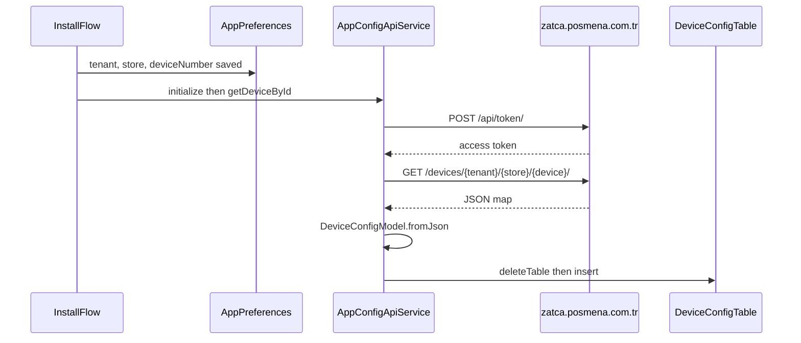

# DeviceConfigModel — data flow and usage

## Purpose and naming

| Concept | Location |
|--------|----------|
| Domain model class | `DeviceConfigModel` in [`lib/data/models/store/device_info_model.dart`](../lib/data/models/store/device_info_model.dart) |
| SQLite access layer | `DeviceConfigTable` in [`lib/data/services/local_data/device/device_info_table.dart`](../lib/data/services/local_data/device/device_info_table.dart) |
| Physical table name | `device_config` (created via `AppDB` at startup) |

## End-to-end flow (API → SQLite)

After a successful device installation, the app persists device and ZATCA-related configuration by calling the **App Config** HTTP API once, then storing the result locally. There is no periodic refresh of this row from that API in the current codebase; features read the cached row from SQLite.

**Entry point:** [`lib/core/helpers/install_functions.dart`](../lib/core/helpers/install_functions.dart) — `InstallFunctions.handleSaveAndNavigate` saves tenant, store, device number, and related install fields to `AppPreferences`, then:

1. Constructs `AppConfigApiService()` and calls `initialize()`.
2. Calls `getDeviceById()`.
3. Reads back `DeviceConfigTable.getDeviceInfo()` to decide whether to navigate to login or show an error (with a bypass when environment is testing).

**API layer:** [`lib/data/services/remote_data/implementations/app_config_api_service.dart`](../lib/data/services/remote_data/implementations/app_config_api_service.dart) — `getDeviceById()`:

- Reads `tenant`, `store`, and `deviceNumber` from `AppPreferences`.
- Obtains a bearer token via `getAccessToken()` (POST `/api/token/`).
- GET `/devices/$tenantId/$storeNumber/$deviceNumber/`.
- On HTTP 200: `DeviceConfigModel.fromJson(response.data!)`, then `DeviceConfigTable.deleteTable()` and `DeviceConfigTable.insert(device)`.

**Contract:** [`lib/data/services/remote_data/interfaces/app_config_api_interface.dart`](../lib/data/services/remote_data/interfaces/app_config_api_interface.dart).

**Service locator:** [`lib/data/services/remote_data/service_locator.dart`](../lib/data/services/remote_data/service_locator.dart) exposes `appConfigApiServiceProvider` for `AppConfigApiInterface`. The install flow currently **instantiates `AppConfigApiService()` directly** instead of using that provider.

**Write path:** In the repository, `DeviceConfigTable.insert` is only called from `AppConfigApiService.getDeviceById()` after a successful GET. Runtime code uses `getDeviceInfo()` or `getAll()` for reads.



## JSON field mapping

Dart property ↔ JSON key (as used in `fromJson` / `toJson`):

| Dart property | JSON key |
|---------------|----------|
| `id` | `id` |
| `tenantId` | `tenant_id` |
| `tenantIdZatca` | `tenant_id_zatca` |
| `usernameZatca` | `username_zatca` |
| `passwordZatca` | `password_zatca` |
| `storeNumber` | `store_number` |
| `deviceNumber` | `device_number` |
| `publicKey` | `public_key` |
| `privateKey` | `private_key` |
| `companyName` | `company_name` |
| `address` | `address` |
| `vat` | `vat` |
| `crNumber` | `cr_number` |
| `terminalId` | `terminal_id` |
| `predefinedSequence` | `predefined_sequence` |
| `logo` | `logo` |
| `storeCode` | `store_code` |
| `feedmenaAccountId` | `feedmena_account_id` |
| `feedmenaAuthKey` | `feedmena_auth_key` |
| `zigsAccountId` | `zigs_account_id` |
| `zigsAuthKey` | `zigs_auth_key` |

## True runtime usages (what each field is used for)

After install, features read `DeviceConfigModel` from SQLite (`DeviceConfigTable.getDeviceInfo()`) and use fields for specific business behaviors:

| Field(s) | Real usage in app behavior |
|----------|----------------------------|
| `terminalId` | Initializes NearPay terminal sessions and gates card-payment availability (if missing, payment path is blocked or test dialog shows error). |
| `tenantIdZatca`, `usernameZatca`, `passwordZatca` | Authenticates against ZATCA endpoints and sets tenant header (`abp.tenantid`) before invoice/report calls. Also used as readiness checks before ZATCA sync/login operations. |
| `zigsAccountId`, `zigsAuthKey` | Sent as HTTP headers (`X-Account-ID`, `X-Auth-Key`) for ZIGS invoice API calls. |
| `feedmenaAccountId`, `feedmenaAuthKey`, `storeCode` | Sent as headers and branch identifier when posting customer feedback (`branch_id`). |
| `storeCode` + `deviceNumber` | Builds invoice/receipt reference prefixes like `<storeCode>-<deviceNumber>...` used in sync and invoice payload generation. |
| `companyName`, `address`, `vat` | Rendered on printed/PDF invoice headers as seller legal/identity information. |
| `logo` | Loaded as store logo for PDF/receipt rendering and report views. |
| `privateKey`, `publicKey`, `crNumber`, `vat`, `companyName`, `address` | Used to build and validate ZATCA compliance metadata (`Seller`) before invoice signing/generation. |
| `storeNumber`, `companyName`, `deviceNumber` | Displayed in cashier/X-report style reporting headers and metadata sections. |
| `toJson()` (all fields) | Printed for diagnostics in debug screens and install logs to inspect loaded device configuration. |

Notes:

- Some fields are currently stored but have weak/no direct runtime usage in this branch (for example `tenantId`, `predefinedSequence`).
- `storeCode` is functionally important for integration payloads and reference numbering, while `storeNumber` appears mostly in report display contexts.

## Maintenance note

`AppConfigApiService` uses a dedicated base URL (`https://zatca.posmena.com.tr` in code) that is **separate from the main back-office / sync API**. Device configuration for receipts and ZATCA is not loaded through the standard menu sync pipeline; it is this install-time fetch plus local SQLite reads.

## Full `DeviceConfigModel` source

Source of truth is [`lib/data/models/store/device_info_model.dart`](../lib/data/models/store/device_info_model.dart); update this section when the model changes.

```dart
class DeviceConfigModel {
  int? id;
  String tenantId;
  String? tenantIdZatca;
  String? usernameZatca;
  String? passwordZatca;
  String storeNumber;
  String deviceNumber;
  String? publicKey;
  String? privateKey;
  String companyName;
  String address;
  String vat;
  String? crNumber;
  String? terminalId;
  String? predefinedSequence;
  String? logo;
  String? storeCode;
  String? feedmenaAccountId;
  String? feedmenaAuthKey;
  String? zigsAccountId;
  String? zigsAuthKey;

  DeviceConfigModel({
    this.id,
    required this.tenantId,
    this.tenantIdZatca,
    this.usernameZatca,
    this.passwordZatca,
    required this.storeNumber,
    required this.deviceNumber,
    this.publicKey,
    this.privateKey,
    required this.companyName,
    required this.address,
    required this.vat,
    this.crNumber,
    required this.terminalId,
    this.predefinedSequence,
    this.logo,
    this.storeCode,
    this.feedmenaAccountId,
    this.feedmenaAuthKey,
    this.zigsAccountId,
    this.zigsAuthKey,
  });

  factory DeviceConfigModel.fromJson(Map<String, dynamic> json) {
    return DeviceConfigModel(
      id: json['id'],
      tenantId: json['tenant_id'],
      tenantIdZatca: json['tenant_id_zatca'],
      usernameZatca: json['username_zatca'],
      passwordZatca: json['password_zatca'],
      storeNumber: json['store_number'],
      deviceNumber: json['device_number'],
      publicKey: json['public_key'],
      privateKey: json['private_key'],
      companyName: json['company_name'],
      address: json['address'],
      vat: json['vat'],
      crNumber: json['cr_number'],
      terminalId: json['terminal_id'],
      logo: json['logo'],
      predefinedSequence: json['predefined_sequence'],
      storeCode: json['store_code'],
      feedmenaAccountId: json['feedmena_account_id'],
      feedmenaAuthKey: json['feedmena_auth_key'],
      zigsAccountId: json['zigs_account_id'],
      zigsAuthKey: json['zigs_auth_key'],
    );
  }

  Map<String, dynamic> toJson() {
    return {
      'id': id,
      'tenant_id': tenantId,
      'tenant_id_zatca': tenantIdZatca,
      'username_zatca': usernameZatca,
      'password_zatca': passwordZatca,
      'store_number': storeNumber,
      'device_number': deviceNumber,
      'public_key': publicKey,
      'private_key': privateKey,
      'company_name': companyName,
      'address': address,
      'vat': vat,
      'cr_number': crNumber,
      'terminal_id': terminalId,
      'predefined_sequence': predefinedSequence,
      'logo': logo,
      'store_code': storeCode,
      'feedmena_account_id': feedmenaAccountId,
      'feedmena_auth_key': feedmenaAuthKey,
      'zigs_account_id': zigsAccountId,
      'zigs_auth_key': zigsAuthKey,
    };
  }
}
```
